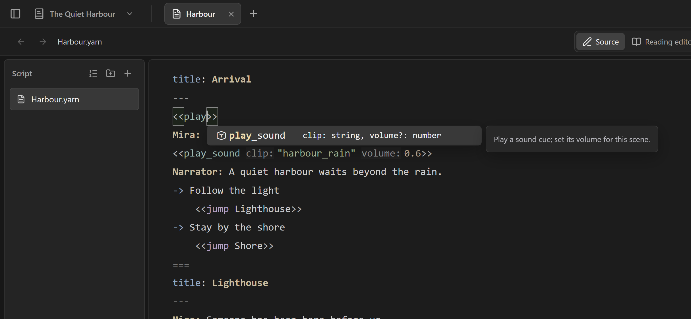
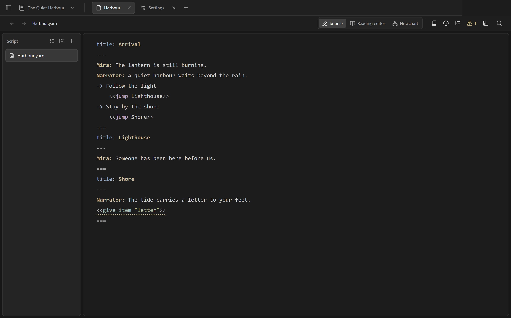
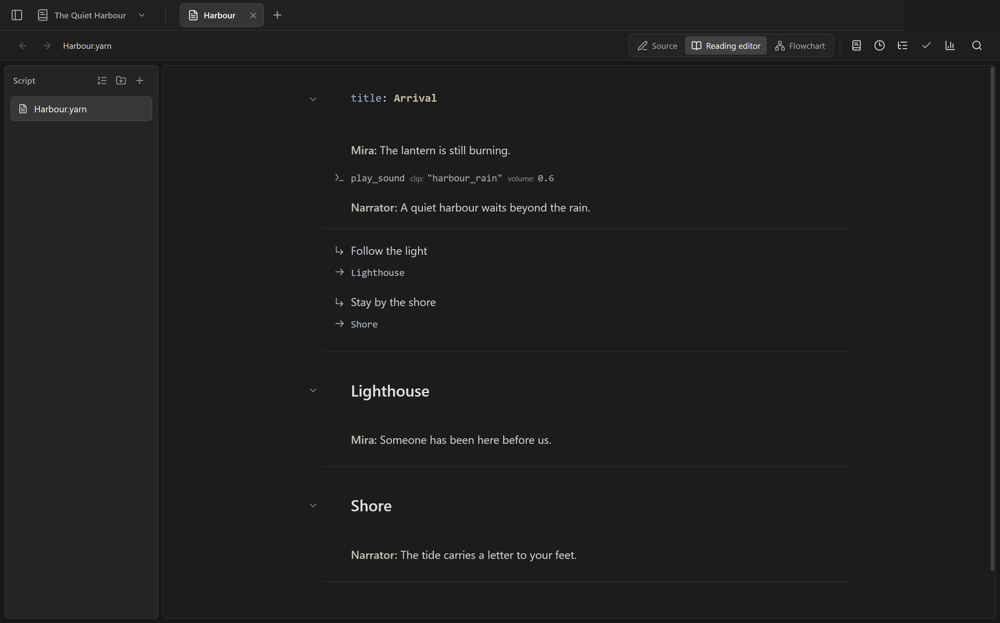
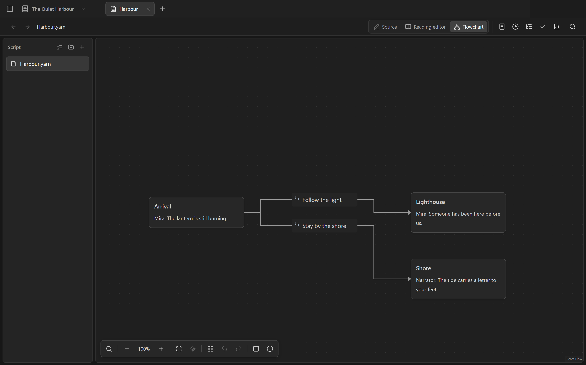
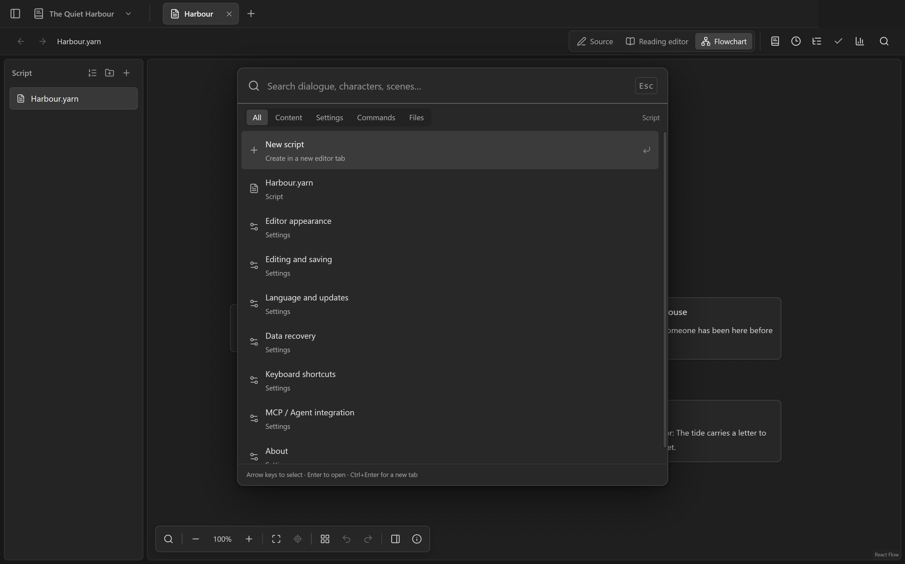
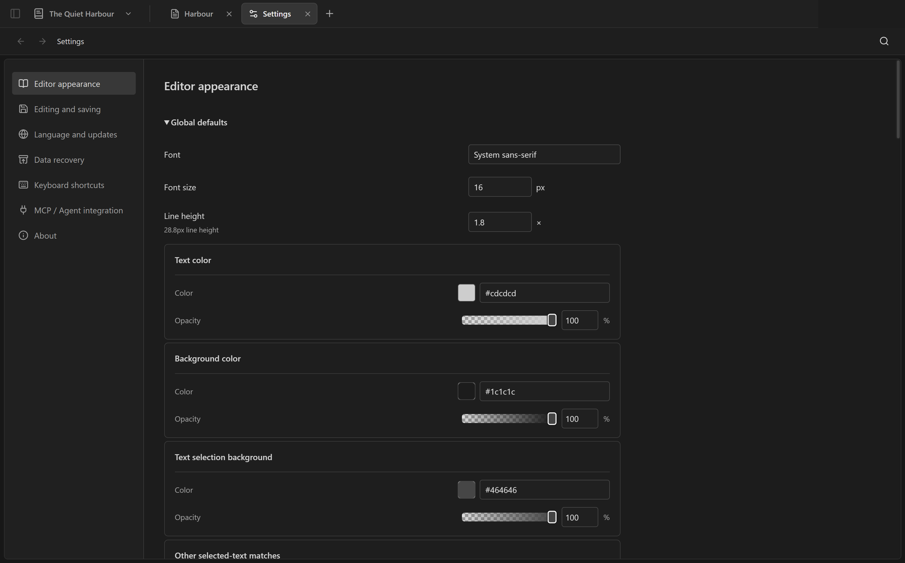
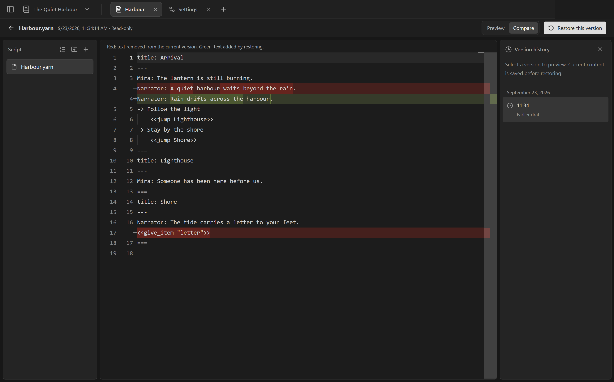
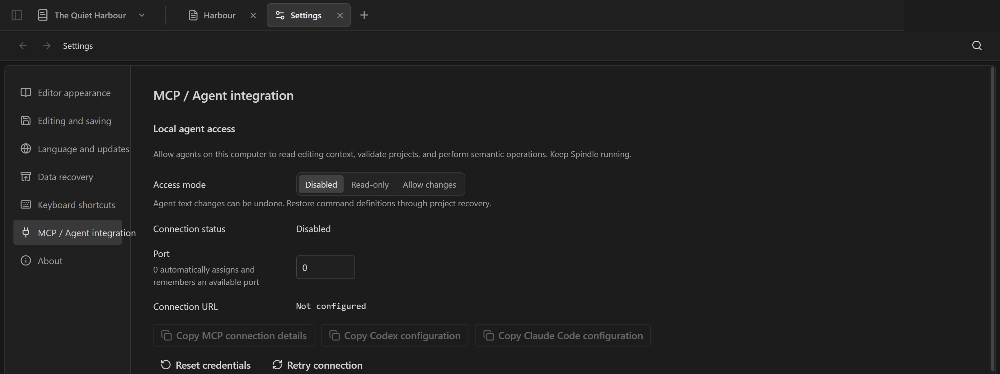

[English](README.md) · [繁體中文](README.zh-TW.md) · [简体中文](README.zh-CN.md)


# Spindle

以本地数据为核心的 Yarn Spinner 剧本编辑器。使用纯文本或阅读编辑编写对话，在流程图整理故事分支，还能通过 MCP 连接本机 Agent。

[下载 Windows x64](https://github.com/RyuuMeow/Spindle/releases) · [版本说明](releases/0.10.0/zh-CN.md) · [报告问题](https://github.com/RyuuMeow/Spindle/issues)

> Portable 与安装版尚未签名。安装前请查看[验证报告](releases/0.10.0/verification.md)。

## 三种视角，同一份故事

### 纯文本

直接编写 Yarn，获得补全、诊断与快速修复。补全包含内置和项目自定义命令及参数提示；悬停在已注册的自定义命令上可查看说明和签名。





### 阅读编辑

以易读的版面直接编辑对话，也可以切换到只显示台词的阅读模式，不改动 Yarn 原文。



### 流程图

需要时主动整理场景，移动卡片与 pin 并保存自己的布局。



## 搜索、历史与风格

从同一列表搜索剧本、内容、设置与命令。项目支持安静的自动保存、文档历史、多窗口和可恢复的回收站；编辑器风格可设置全局默认值并逐模式覆盖。

| 统一搜索 | 编辑器风格 |
| --- | --- |
|  |  |

恢复前可以先比较保存的版本。



## 开始编写

1. 在初始页面打开项目文件夹或创建新项目。
2. 按 **Ctrl+P** 选择「新建剧本」，命名并编写 Yarn。
3. 切换纯文本、阅读编辑与流程图；**Ctrl+Shift+F** 搜索项目和设置。

设置、历史与回收站保存在 `.spindle/`；也可独立打开 `.yarn`。新工作区保持空白。

想体验分支，可将 [The Last Light 示例项目](examples/demo-project/the-last-light/README.md) 复制到个人文件夹后在 Spindle 打开。三份剧本和自定义命令定义不会成为默认项目。

## MCP 与 Skill

在「设置 → MCP／Agent 集成」启用只读或修改权限，再安装用户级 Codex／Claude Code 连接与 [Spindle Skill](skills/spindle/SKILL.md)。Spindle 必须保持运行。Agent 可读取选区、检查剧本、管理命令并执行版本保护修改；安装 Skill 不改变 Agent 批准规则。



[接入与安装指南](docs/mcp.zh-CN.md)

## 开发与许可

使用 Node.js 22.22.0 和 `package.json` 指定的 pnpm。

```sh
pnpm install --frozen-lockfile
pnpm dev                 # Web
pnpm desktop:start       # Windows 桌面
pnpm test:unit
pnpm lint
pnpm desktop:pack        # Windows Portable + NSIS
```

产品版本以 `version.json` 为准。Spindle 采用 [GPL-3.0-only](LICENSE)；第三方组件保留各自许可，见[第三方声明](THIRD_PARTY_NOTICES.md)。另见[贡献指南](CONTRIBUTING.md)和[安全问题报告](SECURITY.md)。

[架构](docs/workspace-architecture.zh-CN.md) · [UI 规范](docs/ui-design.zh-CN.md) · [发布流程](docs/releases.zh-CN.md) · [版本记录](CHANGELOG.md)
