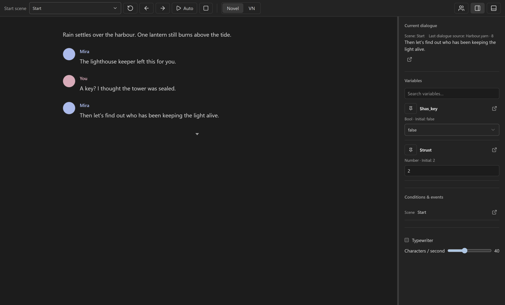
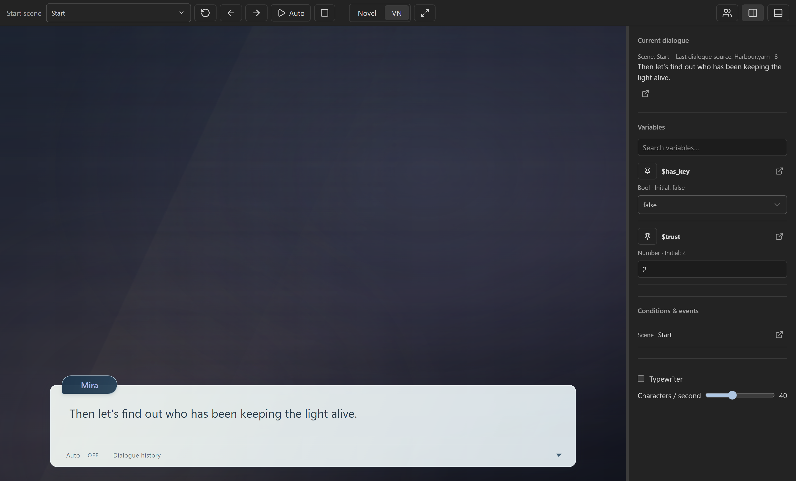
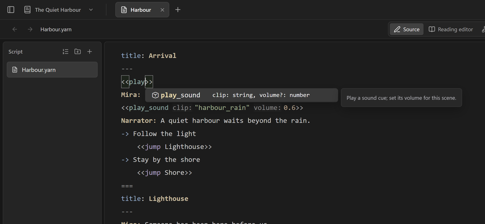
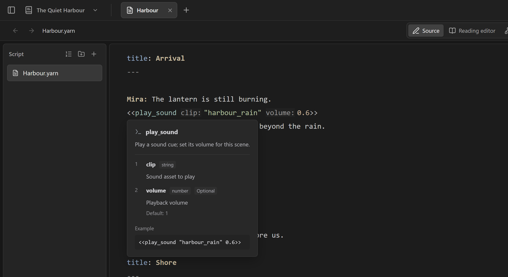
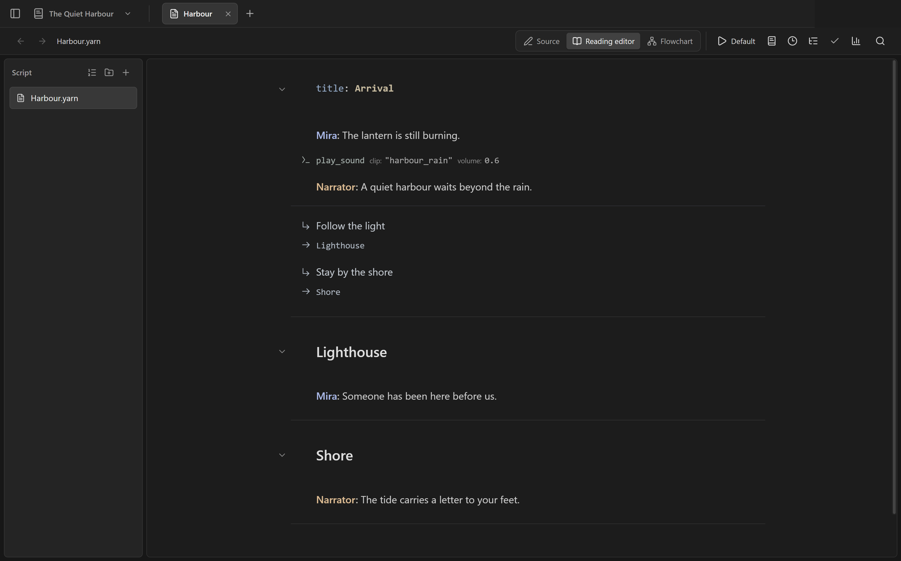
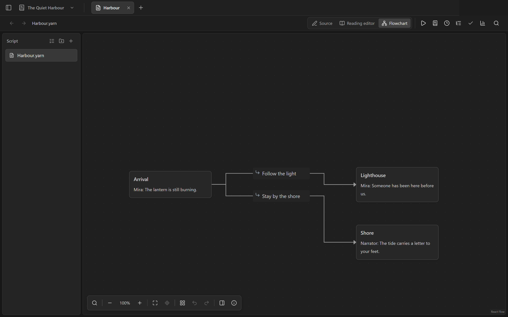
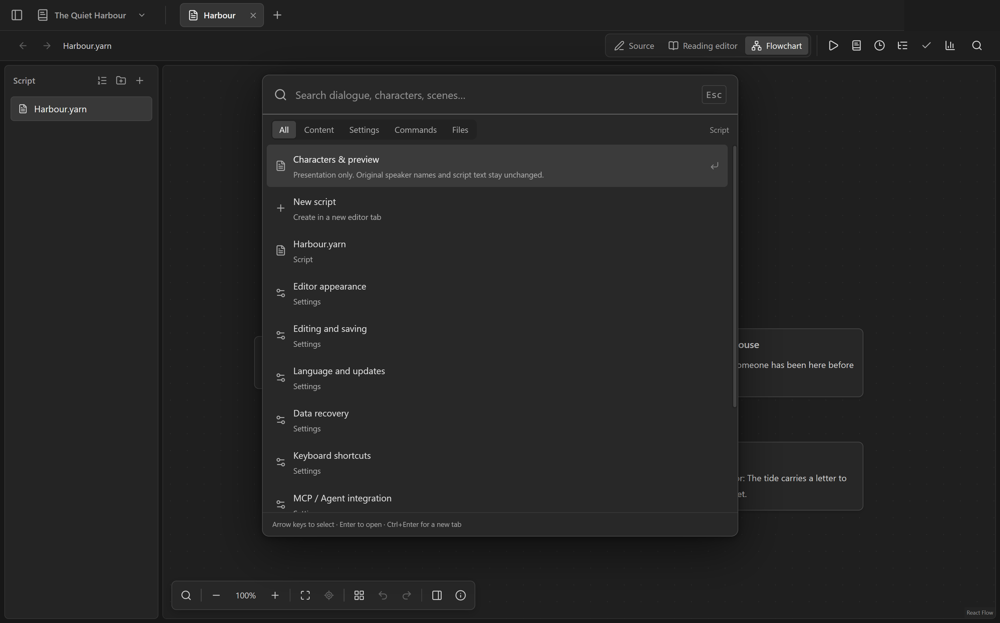
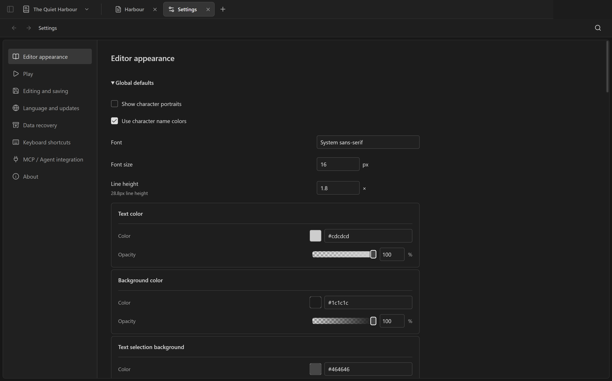
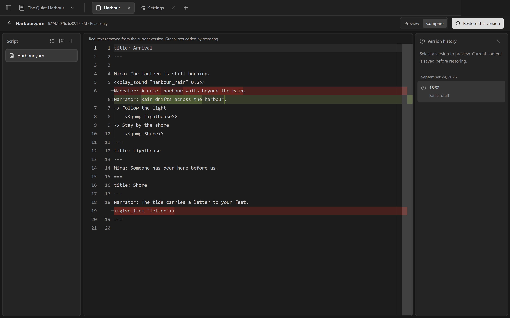

[English](README.md) · [繁體中文](README.zh-TW.md) · [简体中文](README.zh-CN.md)


# Spindle

以本地数据为核心的 Yarn Spinner 剧本编辑器。编写、整理分支、试跑故事，还能让 MCP 助手理解你当前正在编辑的位置，陪你一起修改。

[下载 0.11.1 · Windows x64](https://github.com/RyuuMeow/Spindle/releases/latest) · [版本说明](releases/0.11.1/zh-CN.md) · [报告问题](https://github.com/RyuuMeow/Spindle/issues)

> English · 繁體中文 · 简体中文。Windows x64 Portable 与安装版未签名，详见[验证报告](releases/0.11.1/verification.md)。

## 像坐在编辑器旁边的助手

在 Spindle 选中一句台词，切到 Agent 说：**“帮我改写刚刚选中的段落，保留这个角色的语气。”** Agent 可以按请求读取实时编辑上下文，不必再请你粘贴内容、解释是哪份文件。

通过 MCP，连接的助手能取得：

- **当前文件与场景**，以及对应的内容版本。
- **光标所在行、列**，附近原文与诊断。
- **精确选中内容**，包括多段选区；切到 Agent 后仍保留最后一次选择。
- **指定项目与编辑器窗口**，同时打开多个项目也能明确选定操作目标。

上下文可接着用于查询场景／变量、检查剧本、统计、注册命令、管理文件／文件夹及版本保护修改。例如：“这行为什么有警告？”“帮这个项目注册未知命令”“把选中的对话缩短。”文本修改经过 Spindle 的事务与 Undo。助手也能读取 Play 的当前台词、选项与变量；尚不提供 Agent 操控播放。

**访问由你决定。** MCP 默认关闭。在“设置 → MCP／Agent 集成”选择只读或允许修改，再安装用户级 Codex／Claude Code 连接与 [Spindle Skill](skills/spindle/SKILL.md)。Spindle 必须保持打开；上下文在请求时获取，不是眼球追踪或持续录制画面。安装 Skill 不会改变 Agent 的批准规则。

[连接你的助手](docs/mcp.zh-CN.md)

## 试跑、查看状态、回到原文

以独立 Play 窗口试跑，在逐行小说与双行 VN 之间切换而不重跑故事。查看变量、选项与指令事件，回到上一步，或定位原文修改。你继续编写时，本轮试跑仍保留启动时的内容版本。

| 逐行小说 | VN 呈现 |
| --- | --- |
|  |  |

角色支持自动姓名配色、头像、立绘变体与背景。角色修改自动保存，编辑器与 Play 的显示开关独立控制。自定义命令可明确设置预览效果，不执行任意游戏程序。

右键点击编辑器 Play 按钮，选择“默认”“当前文件”或支持的“当前行”；在设置 → Play 搜索默认场景。Windows 版内含官方 Yarn Spinner runtime，可离线试跑，无需另装 .NET。[Play 操作与当前范围](docs/play.zh-CN.md)

## 三种视角，同一份故事

### 纯文本

直接编写 Yarn，获得补全、诊断与快速修复。补全包含内置和项目自定义命令及参数提示；悬停在已注册的自定义命令上可查看说明和签名。变量类型、声明和来源导航支持跨文件；输入时保持安静诊断，可设置台词长度提醒。





### 阅读编辑

以易读的版面直接编辑对话，也可以切换到只显示台词的阅读模式，不改动 Yarn 原文。



### 流程图

需要时主动整理场景，移动卡片与 pin 并保存自己的布局。



## 搜索、历史与风格

从同一列表搜索剧本、内容、设置与命令。项目支持安静的自动保存、文档历史、多窗口和可恢复的回收站；编辑器风格可设置全局默认值并逐模式覆盖。

| 统一搜索 | 编辑器风格 |
| --- | --- |
|  |  |

恢复前可以先比较保存的版本。



## 开始编写

1. 在初始页面打开项目文件夹或创建新项目。
2. 按 **Ctrl+P** 选择「新建剧本」，命名并编写 Yarn。
3. 切换纯文本、阅读编辑与流程图；**Ctrl+Shift+F** 搜索项目和设置。

设置、历史与回收站保存在 `.spindle/`；也可独立打开 `.yarn`。新工作区保持空白。

想体验分支，可将 [The Last Light 示例项目](examples/demo-project/the-last-light/README.md) 复制到个人文件夹后在 Spindle 打开。三份剧本和自定义命令定义不会成为默认项目。

## 开发与许可

使用 Node.js 22.22.0 和 `package.json` 指定的 pnpm。

```sh
pnpm install --frozen-lockfile
pnpm dev                 # Web
pnpm desktop:start       # Windows 桌面
pnpm test:unit
pnpm lint
pnpm desktop:pack        # Windows Portable + NSIS
```

产品版本以 `version.json` 为准。Spindle 采用 [GPL-3.0-only](LICENSE)；第三方组件保留各自许可，见[第三方声明](THIRD_PARTY_NOTICES.md)。另见[贡献指南](CONTRIBUTING.md)和[安全问题报告](SECURITY.md)。

[架构](docs/workspace-architecture.zh-CN.md) · [UI 规范](docs/ui-design.zh-CN.md) · [发布流程](docs/releases.zh-CN.md) · [版本记录](CHANGELOG.md)
